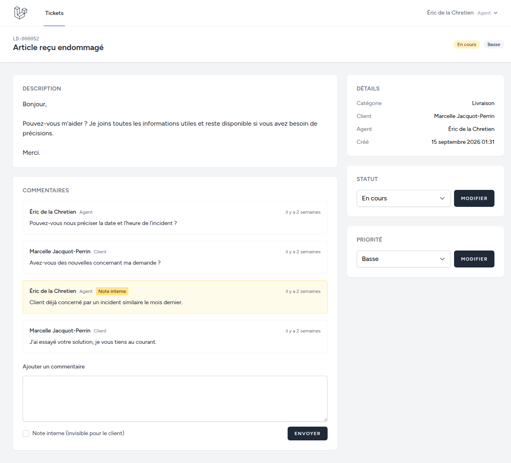
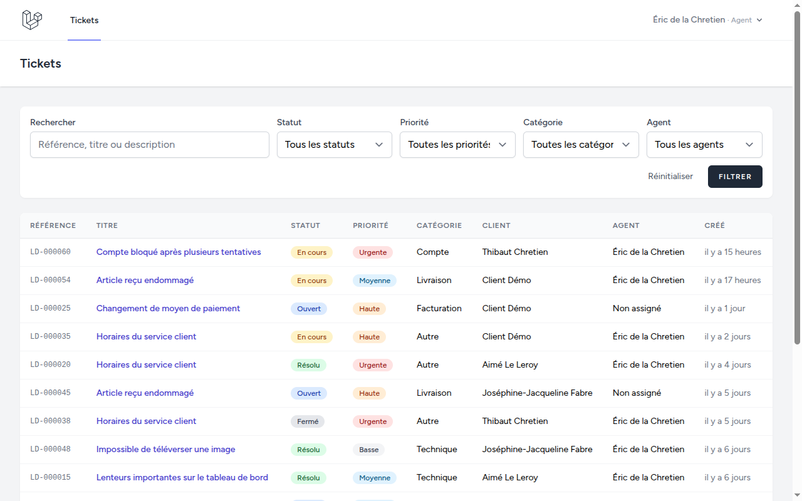
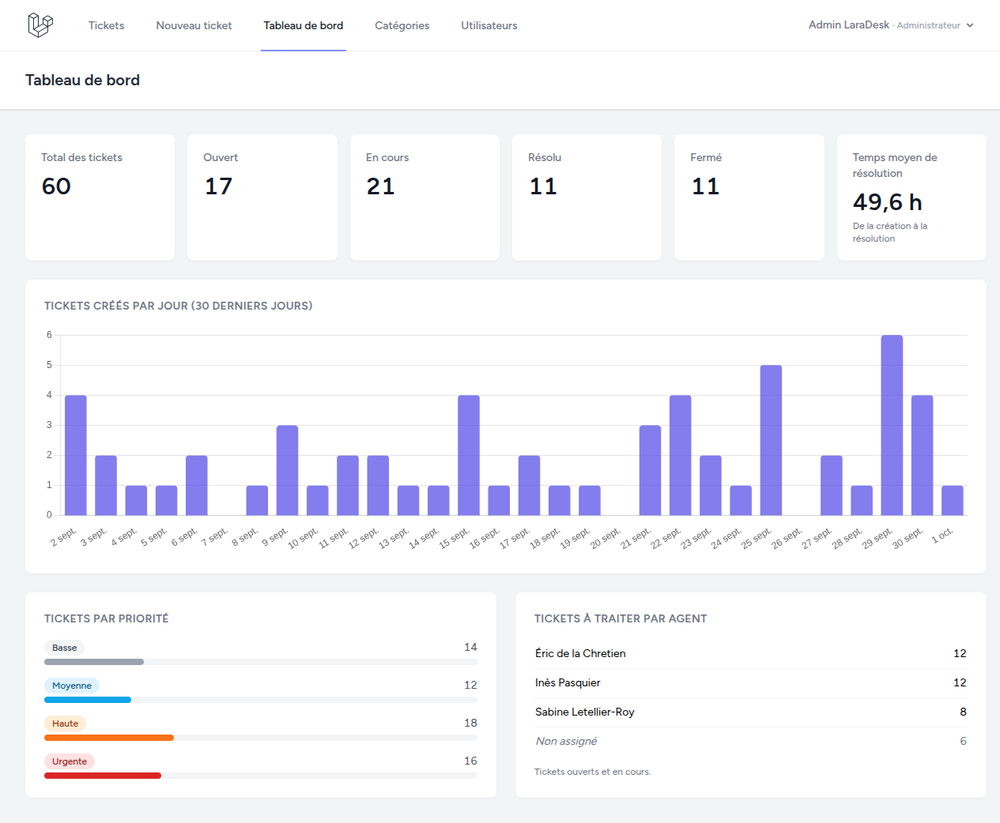
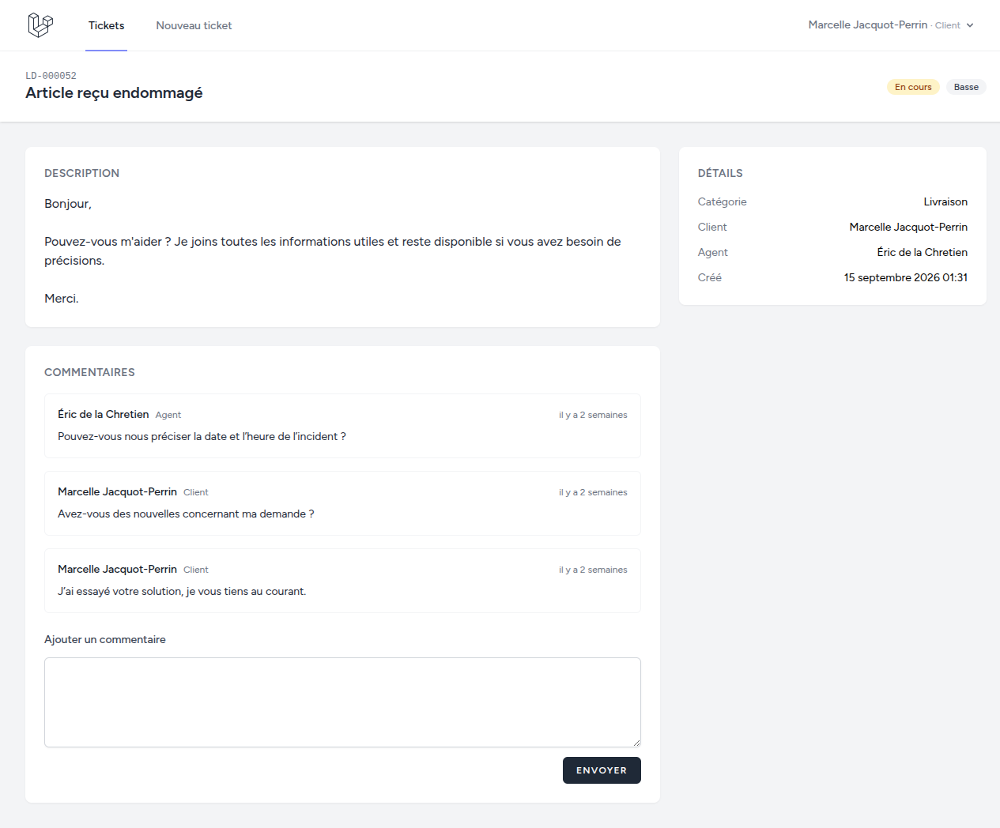
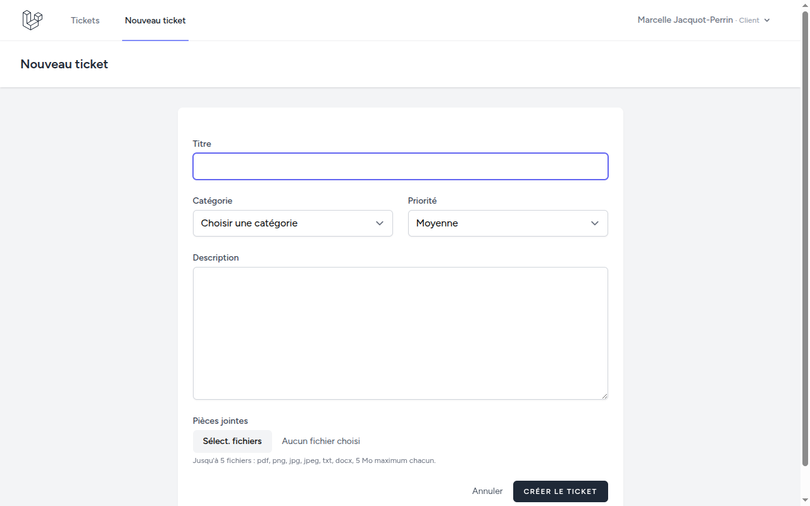
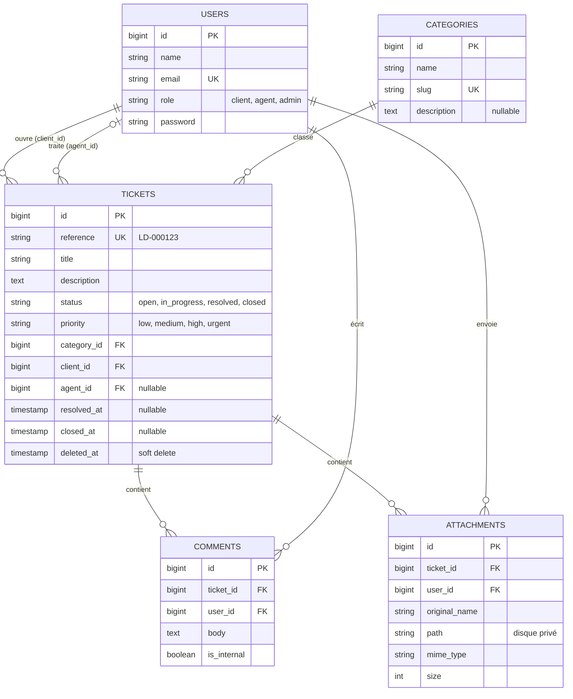

# LaraDesk

[](https://github.com/Ramzi-su/laradesk/actions/workflows/ci.yml)


**Plateforme de gestion de tickets de support client.** Les clients ouvrent des tickets, les agents
les traitent et un administrateur supervise l'ensemble depuis un tableau de bord.

C'est un projet portfolio : l'objectif est un code **Laravel propre et idiomatique** (Policies,
Form Requests, API Resources, Notifications en file d'attente, Scheduler, Sanctum…), couvert par
plus de 150 tests.



## Sommaire

- [Captures d'écran](#captures-décran)
- [Fonctionnalités](#fonctionnalités)
- [Choix techniques](#choix-techniques)
- [Stack technique](#stack-technique)
- [Base de données](#base-de-données)
- [Installation](#installation)
- [Comptes de démo](#comptes-de-démo)
- [File d'attente et planificateur](#file-dattente-et-planificateur)
- [API REST](#api-rest)
- [Tests](#tests)
- [Auteur](#auteur)

## Captures d'écran

| Liste des tickets (agent) | Tableau de bord (admin) |
|---|---|
|  |  |
| **Le même ticket vu par la cliente** : la note interne n'apparaît pas | **Création d'un ticket** avec pièces jointes |
|  |  |

## Fonctionnalités

### Selon le rôle

| Action | Client | Agent | Admin |
|---|:-:|:-:|:-:|
| Voir les tickets | les siens | assignés + non assignés | tous |
| Créer un ticket (avec pièces jointes) | ✅ | | ✅ |
| Modifier titre / description | le sien, s'il est ouvert | | ✅ |
| Changer le statut | fermer le sien s'il est résolu | ses tickets | ✅ |
| Changer la priorité | | ses tickets | ✅ |
| Assigner | | se l'attribuer s'il est libre | n'importe quel agent |
| Commenter / note interne | commenter le sien | ses tickets | ✅ |
| Supprimer (soft delete) | | | ✅ |
| Tableau de bord, catégories, rôles | | | ✅ |

### En détail

- **Tickets** : référence unique `LD-000123`, statuts (`ouvert`, `en cours`, `résolu`, `fermé`) et
  priorités (`basse` → `urgente`), liste paginée avec recherche et filtres conservés dans l'URL.
- **Commentaires** et **notes internes** réservées au staff, jamais visibles par le client
  (ni dans les vues, ni dans l'API, ni dans les e-mails).
- **Pièces jointes** (`pdf`, `png`, `jpg`, `txt`, `docx`, 5 Mo max) stockées sur un disque privé
  et servies uniquement par une route qui vérifie les droits.
- **Notifications e-mail en file d'attente** : changement de statut (client), assignation (agent),
  nouveau commentaire (l'autre partie). Personne n'est notifié de sa propre action.
- **Fermeture automatique** des tickets résolus sans activité depuis 7 jours (commande planifiée).
- **Administration** : catégories, rôles des utilisateurs, tableau de bord avec statistiques et
  graphique Chart.js.
- **API REST versionnée** (`/api/v1`) avec tokens Sanctum.
- Interface **en français** et responsive.

## Choix techniques

Les points que je défendrais en entretien, avec le fichier où les trouver :

- **Autorisation en un seul endroit.** Une Policy par modèle
  ([`TicketPolicy`](app/Policies/TicketPolicy.php)) et un scope
  [`Ticket::forUser()`](app/Models/Ticket.php) pour les listes. Le web et l'API réutilisent **les
  mêmes** Policies et Form Requests : impossible que les règles divergent. Un identifiant dans
  l'URL ne suffit jamais (protection IDOR testée).
- **La Policy dit « sur quel ticket », la Form Request dit « avec quelle valeur ».** Un client peut
  agir sur son ticket résolu (Policy), mais uniquement pour le fermer
  (`Rule::enum()->only()` dans [`UpdateTicketStatusRequest`](app/Http/Requests/UpdateTicketStatusRequest.php)).
- **Enums PHP plutôt que colonnes `ENUM` MySQL** : les valeurs autorisées vivent dans le code
  ([`app/Enums`](app/Enums)), et ajouter un statut ne demande aucune migration.
- **Notifications déclenchées par les observers**
  ([`TicketObserver`](app/Observers/TicketObserver.php)) : un changement de statut via le web,
  l'API ou la commande planifiée notifie toujours, sans code dupliqué.
- **Référence générée dans l'événement `created`**, à partir de l'`id` auto-incrémenté : calculer
  « max + 1 » avant l'insertion provoquerait des doublons sous charge (*race condition*).
- **Mode strict d'Eloquent** hors production : une requête N+1 ou un attribut ignoré par la
  protection *mass assignment* lève une exception au lieu de passer inaperçu.
- **Tableau de bord sans charger les tickets en mémoire** : une requête SQL agrégée par statistique
  ([`TicketStatistics`](app/Queries/TicketStatistics.php)). Un test vérifie que le nombre de
  requêtes reste constant quel que soit le nombre de tickets.
- **Sécurité de l'API** : tokens qui expirent (7 jours), *rate limiting* (60 req/min, login limité
  par email+IP et par IP), même message d'erreur que l'email existe ou non, erreurs JSON homogènes
  qui ne révèlent pas les noms de classes.

## Stack technique

| | |
|---|---|
| Backend | Laravel 13, PHP 8.5 |
| Base de données | MySQL 8 (y compris pour les tests) |
| Frontend | Blade, Tailwind CSS, Alpine.js, Chart.js, Vite |
| Authentification | Laravel Breeze (web), Laravel Sanctum (API) |
| Files d'attente | driver `database` |
| Qualité | PHPUnit, Laravel Pint (PSR-12) |
| Environnement | Laravel Sail (Docker : PHP, MySQL, Mailpit) |
| CI | GitHub Actions (Pint + PHPUnit sur MySQL) |

## Base de données



## Installation

### Avec Laravel Sail (Docker)

Prérequis : Docker.

```bash
git clone https://github.com/Ramzi-su/laradesk.git && cd laradesk
cp .env.example .env

# Installe les dépendances PHP sans avoir PHP sur la machine
# (image Composer officielle de Sail ; l'application tourne ensuite dans le conteneur PHP 8.5)
docker run --rm -u "$(id -u):$(id -g)" -v "$(pwd):/var/www/html" -w /var/www/html \
    laravelsail/php84-composer:latest composer install --ignore-platform-reqs

./vendor/bin/sail up -d
./vendor/bin/sail artisan key:generate
./vendor/bin/sail artisan migrate --seed
./vendor/bin/sail npm install && ./vendor/bin/sail npm run build
```

L'application est disponible sur <http://localhost>. Pour que les liens des e-mails pointent au bon
endroit, mettez `APP_URL=http://localhost` dans `.env`.

> Pour lire les e-mails dans **Mailpit** (<http://localhost:8025>), passez dans `.env` :
> `MAIL_MAILER=smtp`, `MAIL_HOST=mailpit`, `MAIL_PORT=1025`.

### Sans Docker

Prérequis : PHP 8.5 (extensions `intl`, `pdo_mysql`), Composer, Node.js 24, MySQL 8.

```bash
git clone https://github.com/Ramzi-su/laradesk.git && cd laradesk
composer install
cp .env.example .env
php artisan key:generate
```

Dans `.env`, renseignez votre MySQL local (`.env.example` contient les valeurs de Sail) :

```dotenv
DB_HOST=127.0.0.1
DB_USERNAME=laradesk
DB_PASSWORD=votre-mot-de-passe
```

Créez les bases `laradesk` (application) et `testing` (tests), accessibles à cet utilisateur, puis :

```bash
php artisan migrate --seed
npm install && npm run build
php artisan serve        # http://localhost:8000
```

`php artisan migrate:fresh --seed` remet à zéro les données de démo à tout moment.

## Comptes de démo

Mot de passe pour tous les comptes : **`password`**

| Rôle | E-mail |
|---|---|
| Administrateur | `admin@laradesk.test` |
| Agents | `agent1@laradesk.test`, `agent2@laradesk.test`, `agent3@laradesk.test` |
| Client | `client@laradesk.test` (+ 9 autres clients générés) |

Les données de démo comprennent 5 catégories et 60 tickets répartis sur les 30 derniers jours,
avec des conversations et des notes internes.

## File d'attente et planificateur

Les e-mails partent en file d'attente (driver `database`). En local, ils sont écrits dans
`storage/logs/laravel.log` (driver `log`).

```bash
php artisan queue:work          # traite les e-mails en attente
php artisan schedule:work       # lance le planificateur en local
```

| Tâche planifiée | Fréquence |
|---|---|
| `tickets:close-stale` : ferme les tickets résolus sans activité depuis 7 jours | quotidienne |
| `sanctum:prune-expired` : supprime les tokens d'API expirés | quotidienne |

La commande se lance aussi à la main, avec un délai personnalisable :

```bash
php artisan tickets:close-stale --days=3
```

En production, une seule entrée cron suffit : `* * * * * php artisan schedule:run`.

## API REST

Préfixe `/api/v1`, authentification par token Sanctum (`Authorization: Bearer <token>`),
réponses JSON paginées, limitée à 60 requêtes par minute.

| Méthode | Route | Description |
|---|---|---|
| `POST` | `/auth/login` | Renvoie un token (champs `email`, `password`, `device_name` optionnel) |
| `POST` | `/auth/logout` | Révoque le token courant |
| `GET` | `/tickets` | Liste paginée, filtres `status`, `priority`, `category`, `search` |
| `POST` | `/tickets` | Crée un ticket (multipart pour les pièces jointes) |
| `GET` | `/tickets/{id}` | Détail avec commentaires et pièces jointes |
| `PATCH` | `/tickets/{id}/status` | Change le statut |
| `POST` | `/tickets/{id}/comments` | Ajoute un commentaire |
| `GET` | `/attachments/{id}` | Télécharge une pièce jointe |
| `GET` | `/categories` | Liste des catégories |

Codes d'erreur : `401` (token absent ou expiré), `403` (action interdite), `404` (ressource
introuvable), `422` (validation), `429` (trop de requêtes).

### Exemples avec curl

```bash
# Connexion : récupère un token
TOKEN=$(curl -s -X POST http://localhost:8000/api/v1/auth/login \
  -H "Accept: application/json" \
  -d email=client@laradesk.test -d password=password -d device_name=curl | jq -r .token)

# Mes tickets résolus contenant « colis »
curl -s "http://localhost:8000/api/v1/tickets?status=resolved&search=colis" \
  -H "Accept: application/json" -H "Authorization: Bearer $TOKEN" | jq '.data[] | {reference, title}'

# Créer un ticket (catégorie 4 = Livraison) et garder son id
TICKET_ID=$(curl -s -X POST http://localhost:8000/api/v1/tickets \
  -H "Accept: application/json" -H "Authorization: Bearer $TOKEN" \
  -d title="Colis non reçu" -d description="Commande passée il y a 10 jours." \
  -d category_id=4 -d priority=high | jq '.data.id')

# Commenter ce ticket
curl -s -X POST "http://localhost:8000/api/v1/tickets/$TICKET_ID/comments" \
  -H "Accept: application/json" -H "Authorization: Bearer $TOKEN" \
  -d body="Avez-vous des nouvelles ?" | jq

# Déconnexion (révoque le token)
curl -s -X POST http://localhost:8000/api/v1/auth/logout \
  -H "Accept: application/json" -H "Authorization: Bearer $TOKEN" -o /dev/null -w "%{http_code}\n"
```

## Tests

Plus de 150 tests PHPUnit (principalement des tests *Feature*), exécutés sur **MySQL** comme en
production, dans la base `testing`.

```bash
php artisan test                                  # toute la suite
php artisan test --filter=TicketPolicyTest        # une classe
php artisan test tests/Feature/Api                # un dossier
vendor/bin/pint --test                            # style de code (comme la CI)
```

Avec Sail : `./vendor/bin/sail artisan test` (la base `testing` est créée par le conteneur MySQL).

Ce qui est couvert, entre autres :

- chaque règle de la matrice des rôles, et les tentatives d'accès aux tickets des autres (IDOR) ;
- validation des formulaires et de l'API (422), fichiers interdits ou trop lourds ;
- notes internes jamais visibles par le client (vue, API, e-mails) ;
- API : login, token absent ou expiré (401), filtres, *rate limiting* (429) ;
- notifications envoyées au bon destinataire et réellement mises en file d'attente ;
- `tickets:close-stale` ne ferme que les tickets éligibles ;
- rendu de chaque page pour chaque rôle, sans requête N+1.

La CI GitHub Actions ([`.github/workflows/ci.yml`](.github/workflows/ci.yml)) vérifie le style
avec Pint puis lance la suite complète sur un service MySQL 8.4, à chaque push et pull request.

## Auteur

**Ramzi Moulahi**

- GitHub : [@Ramzi-su](https://github.com/Ramzi-su)
- LinkedIn : _à compléter_
- Portfolio : _à compléter_
